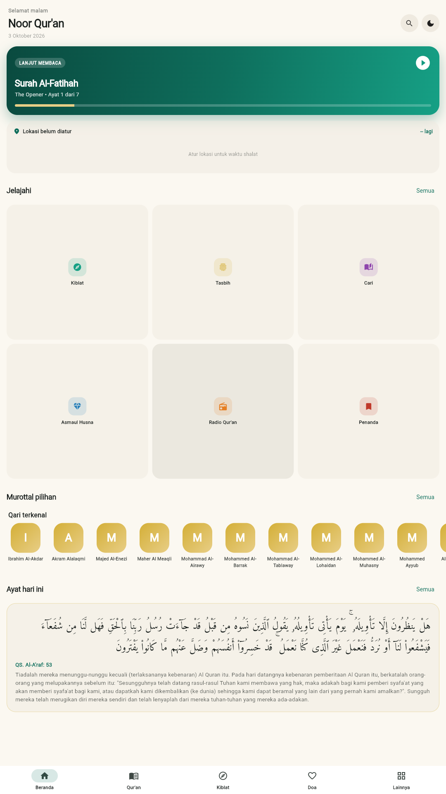
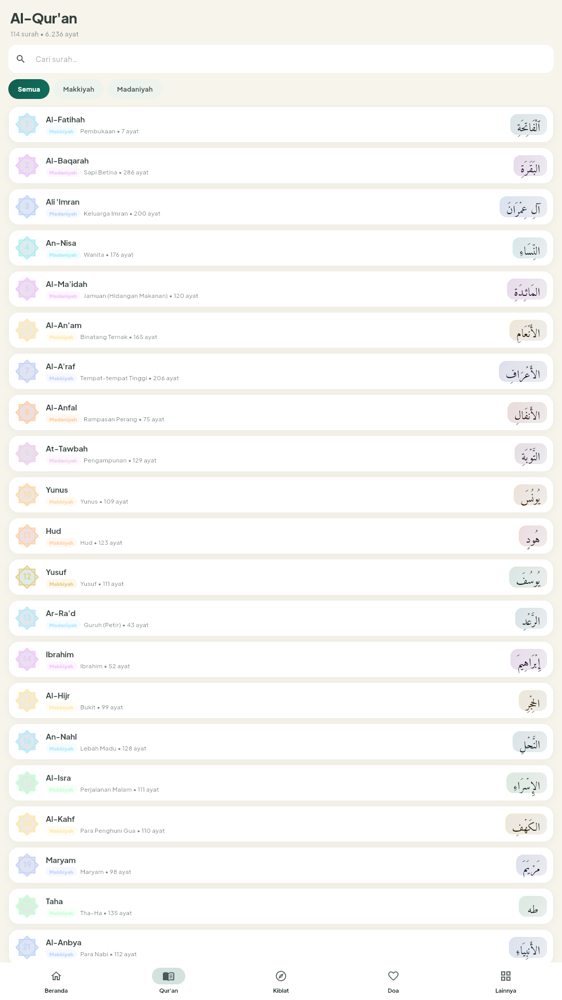
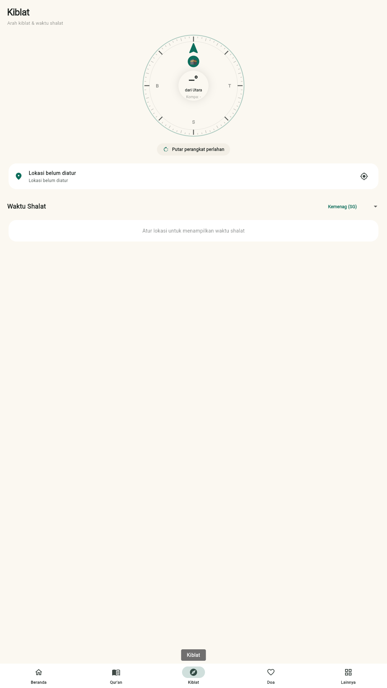
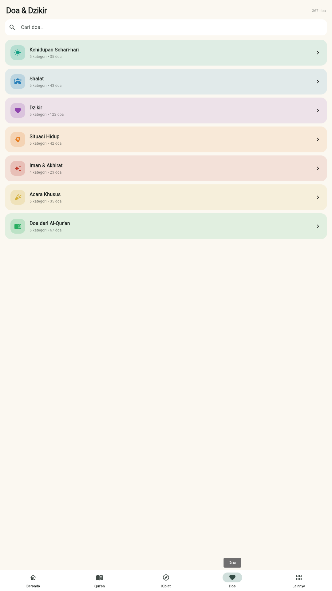
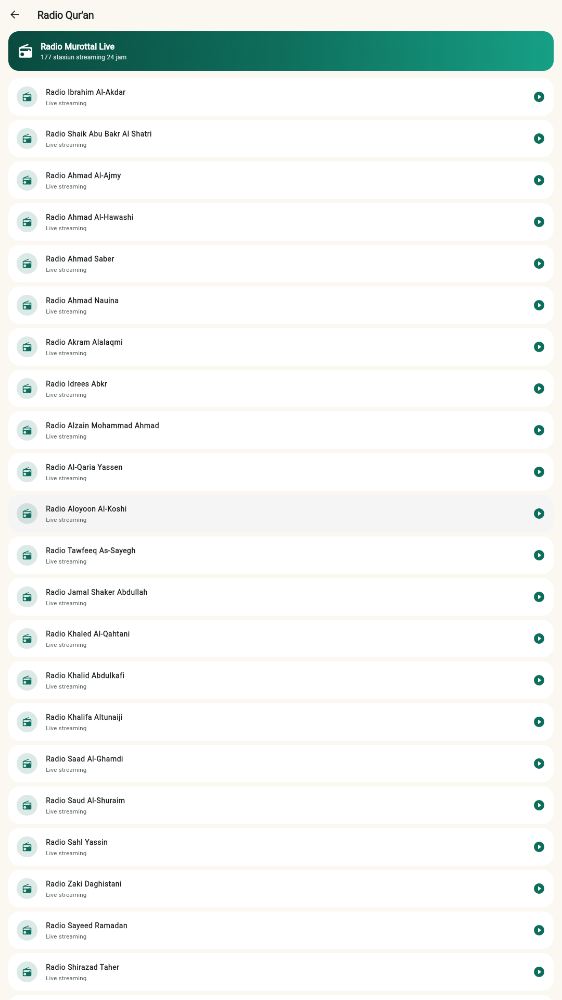
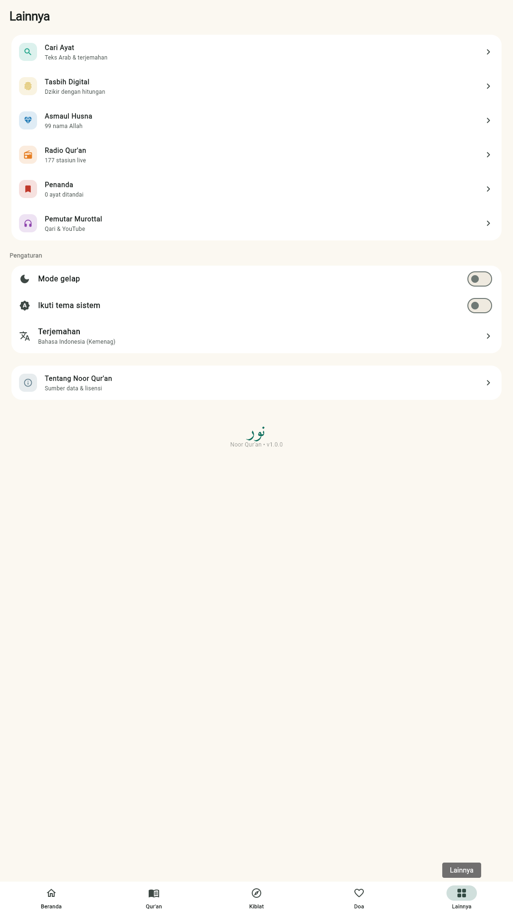

# Noor Qur'an — Complete, Fluid Qur'an App

A complete Qur'an app with embedded Arabic text, multiple translations and tafsir,
live qiblah compass, prayer times, full Hisnul-Muslim dua/dhikr collection,
99 names of Allah, tasbih counter, bookmarks, and a **Qur'anify × Spotify-style
murottal player** that streams from mp3quran.net / islamic.network **and**
embeds YouTube recitations.

Targets **Web, Android, and iOS** from a single Flutter codebase.

## Live

- **Web app:** https://noor-quran-wheat.vercel.app
- **Direct APK download:** https://noor-quran-download.vercel.app/noor-quran.apk (same-origin, no redirects)
- **Android:** release `.aab` (Play Store) + `.apk` — signed, package `com.darrenlieu.noor_quran`

## Screenshots

| Home | Qur'an | Qiblah |
| ---- | ------ | ------ |
|  |  |  |

| Doa & Dzikir | Asmaul Husna | More |
| ------------ | ------------ | ---- |
|  |  |  |

---

## Design system

A single, hand-built identity so every screen feels like one product:

| Token | Where | What |
| ----- | ----- | ---- |
| `AppColors` / `Grad` | `lib/theme/app_theme.dart` | Deep emerald + antique gold palette, curated gradients, light & dark |
| `Motion` | `lib/theme/app_theme.dart` | One easing curve (`easeOutCubic`) and three durations (180/320/560 ms) |
| `FadeRise`, `PressScale`, `NoorCard`, `SectionHeader`, `PageHeader`, `PulseDot` | `lib/widgets/motion.dart` | Shared animation + layout primitives |
| `NoorMark` | `lib/widgets/brand.dart` | Custom-painted eight-pointed star + crescent emblem, used on splash, headers, player |
| `SplashScreen` | `lib/screens/splash_screen.dart` | Branded boot animation, cross-fades into the app shell |
| UI type | Plus Jakarta Sans (`assets/fonts/ui/`) | Weights 400–800; Arabic stays on Amiri Quran |

The launcher icon and all web/PWA icons are generated from one source of
truth by `python tools/make_icon.py` (emerald radial + gold octagram,
crescent and star), including Android adaptive-icon foregrounds.

---

## Stack

| Layer        | Library                                                                |
| ------------ | ---------------------------------------------------------------------- |
| UI / state   | Flutter 3.47, `provider`, `intl`                                       |
| Audio        | `just_audio` + `just_audio_background`, `audio_session`                |
| YouTube      | `youtube_player_iframe`                                                |
| Qiblah       | `geolocator`, `flutter_compass`                                        |
| Prayer times | `adhan`                                                                |
| Persistence  | `shared_preferences`                                                   |
| Sharing      | `share_plus`, `url_launcher`                                           |
| Fonts        | Amiri Quran, Amiri, Scheherazade New (TTF, ~1.3 MB)                    |

---

## Embedded data (assets/data)

| File                 | Size  | Source                                                           |
| -------------------- | ----- | ---------------------------------------------------------------- |
| `quran.json`         | 1.6 M | Al-Quran Cloud — Uthmani, with name translations from quran.com  |
| `t_id.json`          | 1.1 M | id.indonesian (Kemenag)                                          |
| `t_en.json`          | 0.9 M | en.sahih (Saheeh International)                                   |
| `t_en_arberry.json`  | 0.8 M | en.arberry                                                       |
| `tafsir_id.json`     | 2.7 M | id.jalalayn (Tafsir Jalalayn)                                    |
| `asma.json`          | 28 K  | 99 Names of Allah + adiman-dev explanations                      |
| `duas.json`          | 244 K | Hisnul Muslim — 367 duas across 7 segments                      |
| `reciters.json`      | 158 K | mp3quran.net reciter catalog (242) + 177 radios                  |
| `ayah_reciters.json` | 1 K   | 16 verified verse-by-verse reciters on islamic.network           |

Arabic + 3 translations + tafsir + duas + asma + reciters ≈ **7.6 MB**.

---

## Audio architecture

`AudioService` (lib/audio/audio_service.dart) owns a single `AudioPlayer`
that doubles as the background notification player. Two modes:

* **Per-surah** — streams the whole surah mp3 from an mp3quran.net moshaf.
* **Per-ayah** — builds a playlist of 1–6236 individual ayah mp3s from
  the islamic.network CDN. UI auto-scrolls and highlights the current ayah.

The **YouTube tab** in `PlayerScreen` is a separate iframe player with a
curated starter list (Al-Fatihah, Yasin, Ar-Rahman, Al-Mulk, Al-Kahfi,
Al-Waqiah) that can be expanded by editing `_videos`.

---

## Qiblah + prayer times

`QiblahProvider` (lib/state/qiblah_provider.dart):

* Live compass heading from `flutter_compass` (calibrated to magnetic north).
* Bearing computed via great-circle formula; Ka'bah pinned at 21.4225, 39.8262.
* "Aligned" flag lights up when device is within 5° of true qiblah.
* Prayer times via `adhan`, 6 method options, madhab = Shafi'i.

---

## Theming

`lib/theme/app_theme.dart` provides an emerald-and-gold Material 3 theme in
both light and dark modes, with rounded surfaces, predictive back transitions
on Android and Cupertino transitions on iOS.

---

## Running

```bash
flutter pub get
flutter run -d chrome          # Web
flutter run -d <android-device>  # Android
flutter run -d <ios-device>      # iOS (macOS only)
```

`build_data.py` regenerates `assets/data/*.json` from a fresh set of
upstream sources if you ever need to update translations or reciters.

---

## Disk footprint

| Layer             | Size    |
| ----------------- | ------- |
| Source code       | 212 K   |
| Fonts             | 1.3 M   |
| Embedded data     | 7.6 M   |
| Android / iOS / Web templates | ~10 M |
| `.dart_tool` (pub cache)      | 51 M (regenerated) |

Web build (`flutter build web`) outputs ~9 MB total including all assets.